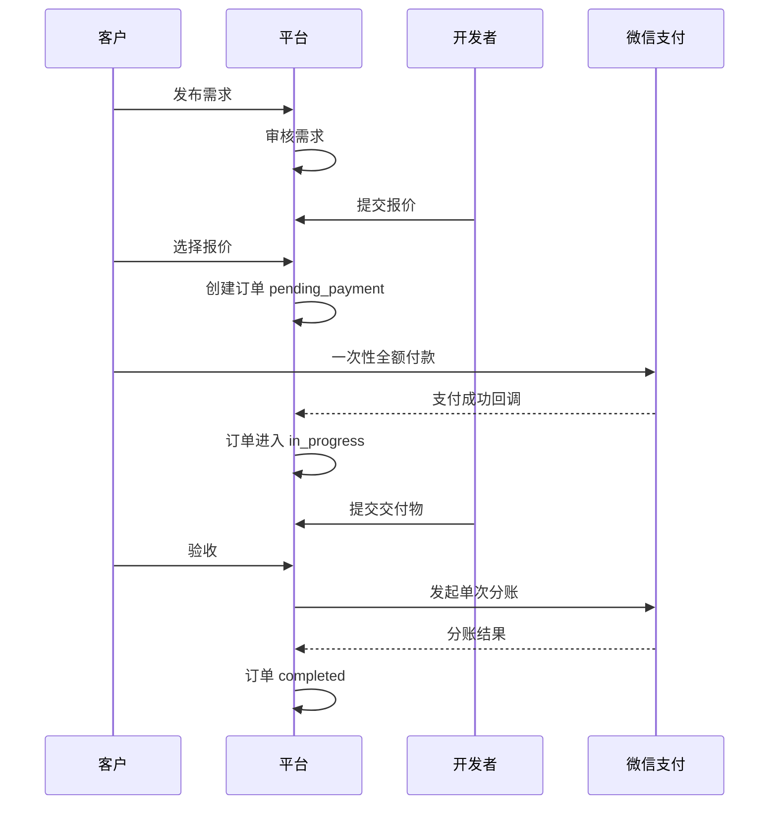

# 资金流、信息流与订单流

**状态：** draft pending WeChat Pay confirmation
**日期：** 2026-06-16
**适用范围：** 第二阶段微信支付资金闭环设计前置材料

## 核心原则

- 客户选标后一次性全额付款。
- 平台不提供用户余额、充值、提现或资金池。
- 开发者完成交付并经客户验收后，执行一次分账。
- 平台只收取成交佣金，佣金、渠道手续费和退款独立记账。
- 首版只设计未分账前全额退款；已分账退款保持 blocked，等待微信支付和财务规则确认。

## 参与方

| 参与方 | 职责 |
|---|---|
| 客户 | 发布需求、选择报价、付款、验收或发起争议 |
| 平台 | 审核供需、撮合交易、保存证据、处理争议、收取佣金 |
| 开发者 | 报价、履约、交付，验收后收款 |
| 微信支付 | 支付、退款、分账、账单、二级商户能力 |

## 订单主流程



## 资金流

```text
客户
  -> 微信支付订单全额付款
  -> 微信支付按产品规则清结算
  -> 验收后分账给开发者二级商户
  -> 平台保留约定技术服务佣金
```

待确认点：

- 客户付款资金在分账前的账户归属和可操作状态。
- 平台佣金是否通过分账差额、手续费配置或其他产品能力体现。
- 分账前退款是否直接原路退回客户。
- 分账后退款是否需要先回退分账、由二级商户出资，或走人工线下处理。
- 渠道手续费在成功交易、退款、失败退款中的承担方式。

## 信息流

```text
客户资料：账号、联系方式、需求、订单、付款状态、验收/争议记录。
开发者资料：账号、作品、技能、入驻状态、二级商户申请号、脱敏收款摘要。
平台资料：审核记录、风控记录、审计日志、客服和争议处理记录。
微信资料：支付单号、退款单号、分账单号、账单文件、回调验签结果。
```

敏感资料策略：

- 身份证、银行卡、证件照片等高敏资料优先直传微信支付。
- 平台只保存必要状态、渠道申请号、脱敏摘要和操作审计。
- 所有回调日志必须脱敏，不记录密钥、证书、验证码、完整签名或完整文件签名 URL。

## 订单状态映射

| 业务事件 | 当前订单状态 | 下一订单状态 | 备注 |
|---|---|---|---|
| 客户选标 | `quoted` | `pending_payment` | 创建待支付订单 |
| 支付成功 | `pending_payment` | `in_progress` | 真实支付回调后推进 |
| 开发者交付 | `in_progress` | `delivered` | 保存交付版本 |
| 客户验收 | `delivered` | `accepted` | 后续发起分账 |
| 分账开始 | `accepted` | `sharing` | Task 18 实现 |
| 分账成功 | `sharing` | `completed` | 订单闭环 |
| 客户拒绝交付 | `delivered` | `disputed` | 可进入争议 |
| 裁决全额退款 | `disputed` | `refund_review` | 等待退款执行 |
| 退款开始 | `refund_review` | `refunding` | Task 18 实现 |
| 退款成功 | `refunding` | `refunded` | 订单关闭 |

## 对账要求

每日对账至少覆盖：

- 平台订单金额与微信支付成功金额。
- 支付状态、订单状态和回调状态是否一致。
- 退款金额、退款状态和订单状态是否一致。
- 分账金额、平台佣金和开发者入账金额是否一致。
- 渠道手续费、退款手续费和账单差异。

差异处理：

1. 先冻结相关订单的自动后续动作。
2. 保存微信账单、平台支付记录、订单状态历史和回调日志。
3. 由运营和财务人工确认差异原因。
4. 只能通过补偿任务或审计记录修正，不直接覆盖历史财务记录。

## 当前系统对应关系

- `payments`：支付单记录。
- `refunds`：退款单记录。
- `profit_shares`：分账记录。
- `order_status_history`：订单状态历史。
- `audit_logs`：后台和关键动作审计。
- `disputes`：争议和裁决记录。

真实微信支付上线前，以上表只能承载模拟支付和设计验证；不得对外宣传资金托管、担保交易或自动分账。
