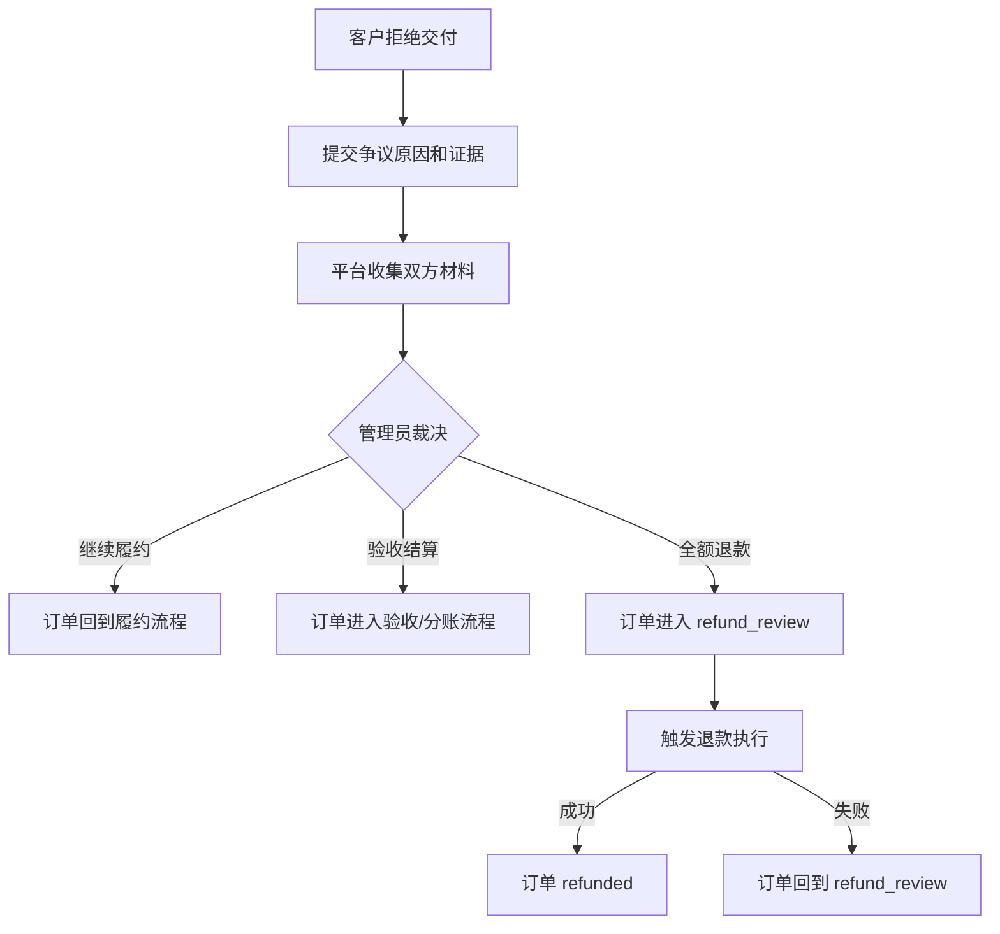

# 退款与争议处理政策

**状态：** draft pending WeChat Pay confirmation
**日期：** 2026-06-16
**适用范围：** 码上好第二阶段支付、退款、分账设计

## 政策边界

首版支付闭环只支持：

- 客户一次性全额付款。
- 订单验收后单次分账。
- 未分账前全额退款。
- 人工争议裁决。

暂不支持：

- 定金和尾款。
- 部分退款。
- 多次分账。
- 平台余额、充值或用户提现。
- 已分账后的自动退款。
- 自动按比例赔付。

## 退款资格

允许进入退款审核的场景：

- 已支付但尚未完成分账。
- 客户拒绝交付并发起争议。
- 管理员裁决为全额退款。
- 支付或订单存在平台确认的异常。

不得自动退款的场景：

- 订单未支付。
- 订单已完成分账。
- 订单正在分账或分账状态不明。
- 证据不足，尚未完成争议裁决。
- 退款金额不等于首版允许的全额退款金额。

## 争议流程



## 证据要求

争议处理前必须保存：

- 原始需求说明和审核记录。
- 开发者报价、价格、周期和服务范围。
- 订单留言和关键沟通记录。
- 附件路径、交付版本和提交时间。
- 客户拒绝验收原因。
- 双方补充说明。
- 管理员裁决说明和操作人。

证据不得硬删除。确需隐藏违规内容时，只做隐藏标记并保留审计日志。

## 裁决类型

| 裁决 | 适用场景 | 后续动作 |
|---|---|---|
| 继续履约 | 问题可修复，双方仍可完成交付 | 订单回到履约或重新交付流程 |
| 验收结算 | 交付已满足需求，客户拒绝理由不成立 | 订单进入验收和分账流程 |
| 全额退款 | 开发者未履约、严重偏离需求或平台确认应退 | 订单进入 `refund_review` |

第一阶段已实现全额退款裁决的状态推进；真实资金退款由 Task 18 在微信支付规则确认后实现。

## 退款执行规则

退款前置检查：

1. 支付单状态必须为 `succeeded`。
2. 订单状态必须为 `refund_review`。
3. 分账状态必须为空、未开始或经微信支付确认可回退。
4. 退款金额必须等于该订单实付金额。
5. 必须存在管理员裁决记录和裁决说明。

退款结果：

- 退款发起成功：订单进入 `refunding`。
- 退款成功回调：订单进入 `refunded`。
- 退款失败：订单回到 `refund_review`，必须记录失败原因。
- 重试退款：必须由管理员确认失败原因后触发。

## 已分账退款

已分账退款保持 blocked，直到微信支付确认以下问题：

- 是否支持对已分账订单发起退款。
- 是否必须先回退分账。
- 开发者二级商户余额不足时如何处理。
- 平台佣金是否同步退还。
- 渠道手续费是否退还或由谁承担。
- 退款失败后的财务补偿和账务处理方式。

在 blocked 状态下，运营不得承诺“已结算订单可自动退款”。

## 运营口径

真实支付上线前，对外只能说明：

```text
平台正在进行支付闭环验证。当前公开成交建议使用线下合同和人工收款。
涉及退款或争议时，以双方合同、平台记录和人工客服处理结论为准。
```

真实支付上线后，所有页面、销售话术和客服回复必须与微信支付实际开通能力、平台服务协议和退款规则一致。
